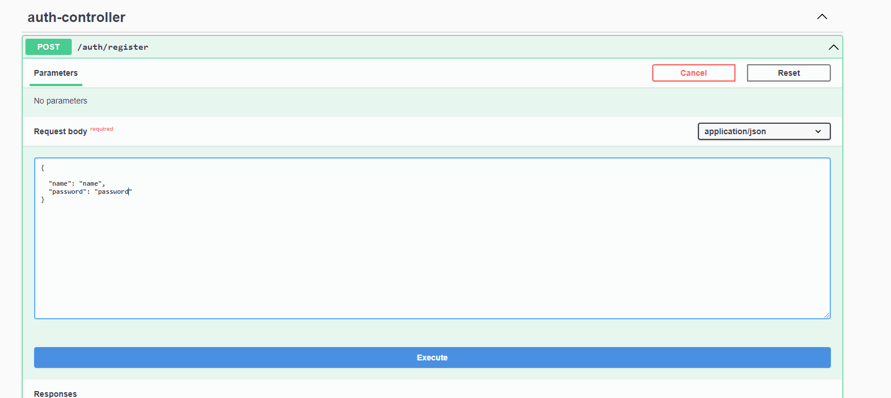
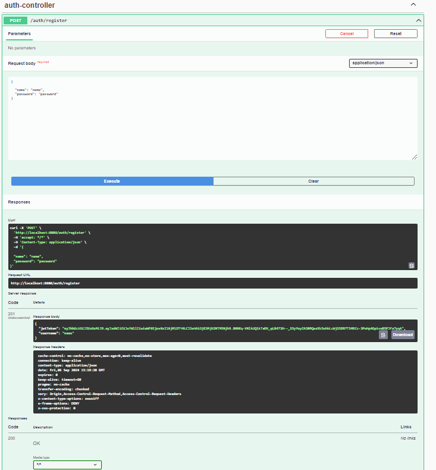
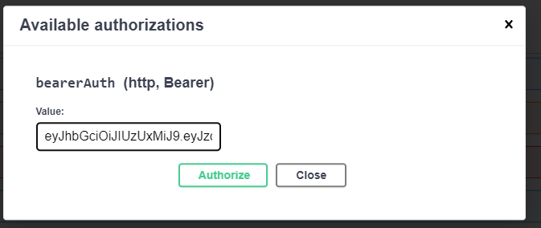
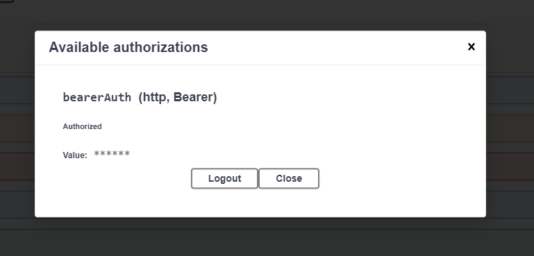

# 할일 (ToDo)

할일 (ToDo) 작업을 관리하기 위해 Spring Boot로 만든 프로젝트입니다.

___

## 주요 기능:

*사용자 관리*:사용자는 JWT로 회원가입하고 로그인하며, 사용자 정보를 만들고 CRUD operation 할 수 있습니다.

*작업 관리*: 사용자는 작업을 만들고, 수정하고, 삭제할 수 있으며, 우선순위, 상태, 기한에 따라 작업을 분류할 수 있습니다.

*JWT 인증*: JWT를 사용해 API를 안전하게 보호하며, 토큰이 있어야 보호된 API에 접근할 수 있습니다.

*RESTful API*: 사용자와 작업을 관리하는 API를 제공하며, JWT로 보안이 적용됩니다.

*Swagger 통합*: Swagger UI로 API 설명서와 테스트 기능을 제공합니다.

*MySQL 데이터베이스*: 사용자와 작업 데이터를 저장하며, Spring Data JPA로 관리합니다.
*Global Exceptiona Handler*: 오류가 발생하면 유용한 메시지를 보여줍니다
___

데이터베이스 설정
애플리케이션을 실행하기 위해, application.properties 파일에서 MySQL 데이터베이스 설정을 변경하세요.

application.properties 파일 열기:

src/main/resources 폴더로 이동하세요.
application.properties 파일을 엽니다.
데이터베이스 연결 정보 업데이트:

아래 설정을 본인의 MySQL 정보로 변경하세요:

#### MySQL 데이터베이스 URL을 입력하세요
spring.datasource.url=jdbc:mysql://localhost:3306/your_database_name

#### MySQL 사용자 이름을 입력하세요
spring.datasource.username=your_mysql_username

#### MySQL 비밀번호를 입력하세요
spring.datasource.password=your_mysql_password

#### 아래 설정은 그대로 유지하세요
spring.jpa.properties.hibernate.dialect=org.hibernate.dialect.MySQLDialect
spring.jpa.hibernate.ddl-auto=update
___
**run the application**
___
## API 명세
*Swagger 통합* : API 문서와 테스트를 위해 Swagger UI에  **http://localhost:8080/swagger-ui/index.html** 에서 접속할 수 있습니다.

아래 단계를 따르세요

1. Authentication and login (token generate)

    write name and password and press EXECUTE

    {
        "name" : "name",
        "password" : "password"
    }

    

2. copy the generated token 생성된 토큰을 복사하세요
   
   

3. Authorize 버튼을 누르세요
   
4. 복사한 token 붙여넣으세요
   
5. Authorize 버튼을 누르고 Close(X) 버튼을 누르세요.
   
6. 이제 API에 접근할 수 있습니다. demo. creating todo
   

___

## APIs
### AuthController
POST /auth/register
설명: 새로운 사용자를 등록하고, 인증을 위한 JWT 토큰을 반환합니다.

### UserController
POST /users
설명: 새로운 사용자를 생성합니다.

GET /users
설명: 모든 사용자 목록을 가져옵니다.

GET /users/{id}
설명: ID로 특정 사용자의 세부 정보를 가져옵니다.

PUT /users/{id}
설명: ID로 기존 사용자를 업데이트합니다.

DELETE /users/{id}
설명: ID로 사용자를 삭제합니다.

### TodoController
POST /todos 

설명: 새로운 작업(ToDo)을 생성합니다.

GET /todos
설명: 모든 작업(ToDo) 목록을 가져옵니다.

GET /todos/{id}
설명: ID로 특정 작업의 세부 정보를 가져옵니다.

PUT /todos/{id}
설명: ID로 기존 작업을 업데이트합니다.

DELETE /todos/{id}
설명: ID로 작업을 삭제합니다.

GET /todos/priority/{priority}
설명: 우선순위(예: 낮음, 중간, 높음)로 작업을 필터링하여 가져옵니다.

GET /todos/status/{status}
설명: 상태(예: 대기 중, 완료)로 작업을 필터링하여 가져옵니다.

GET /todos/next-week
설명: 다음 주 내로 마감 기한이 있는 작업을 가져옵니다.

___

### Database schema (DB 스키마 포함)

*Users Table*

create database todo;   (for creating database todo)

use todo; 

**Creating users table**

CREATE TABLE users (
id BIGINT AUTO_INCREMENT PRIMARY KEY,
name VARCHAR(255) NOT NULL,
password VARCHAR(255) NOT NULL
);

**Inserting the values in the users table**

INSERT INTO users (name, password) VALUES ('kiran', 'korea');

**Creating the todos table**

CREATE TABLE todos (
id BIGINT AUTO_INCREMENT PRIMARY KEY,
title VARCHAR(255) NOT NULL,
description TEXT,
due_date DATE,
priority VARCHAR(50),
status VARCHAR(50),
user_id BIGINT,
FOREIGN KEY (user_id) REFERENCES users(id) ON DELETE CASCADE
);

**Inserting the values**

INSERT INTO todos (title, description, due_date, priority, status, user_id)
VALUES ('Finish project', 'Complete the final report for the project', '2024-09-20', 'MEDIUM', 'COMPLETED', 2);